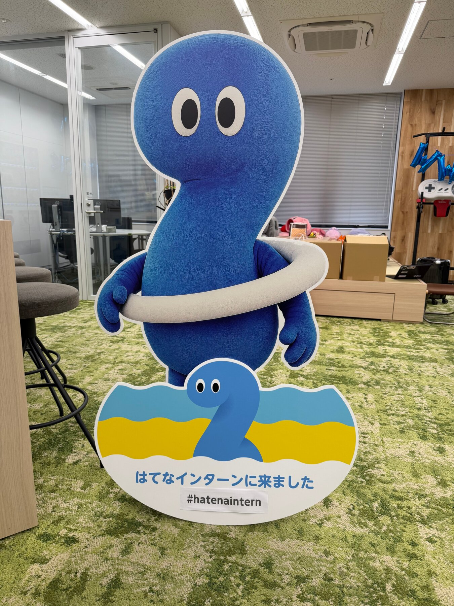
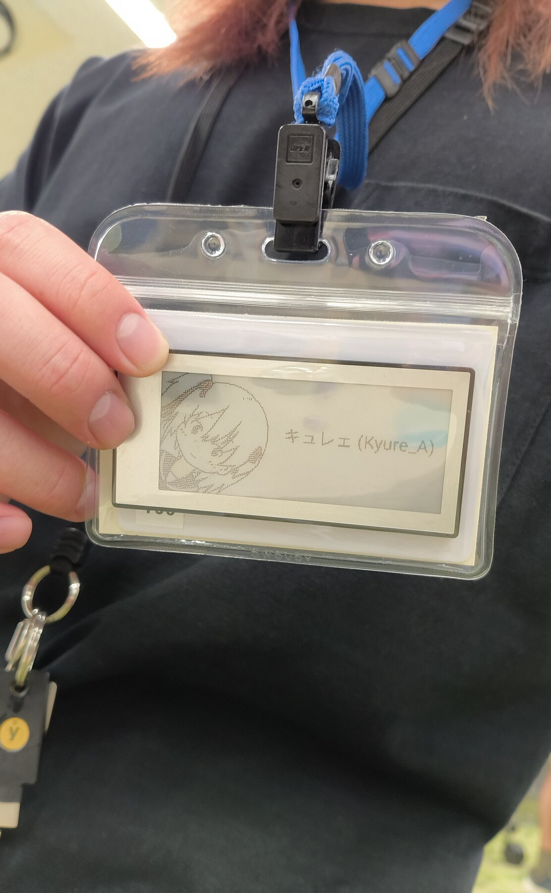
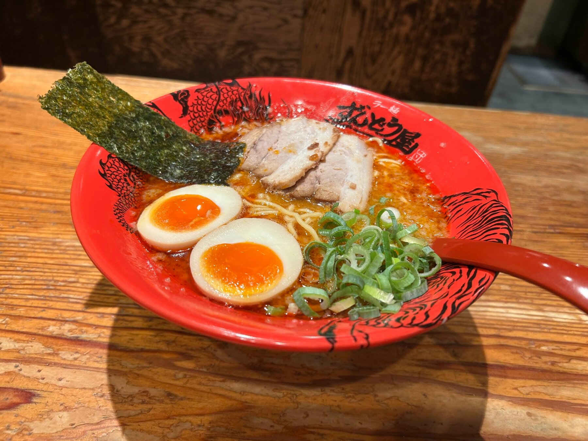
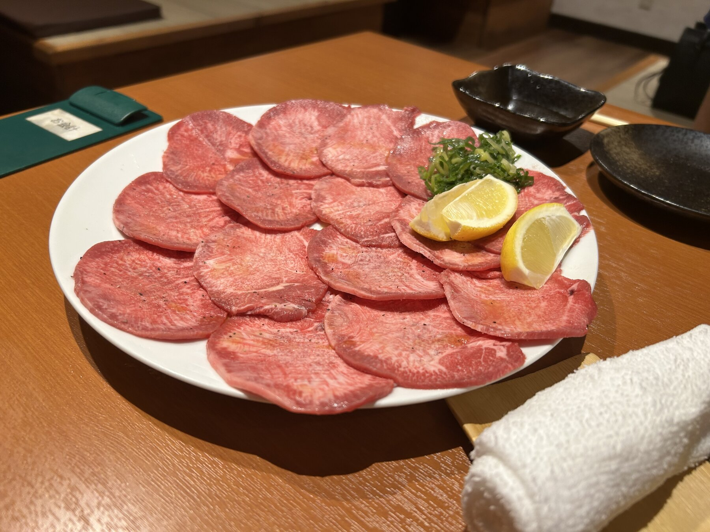
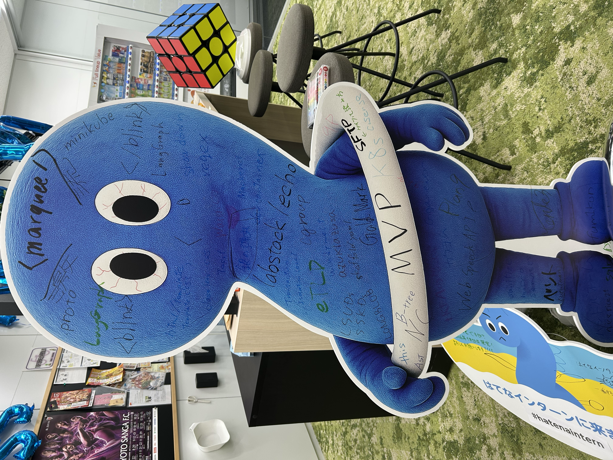
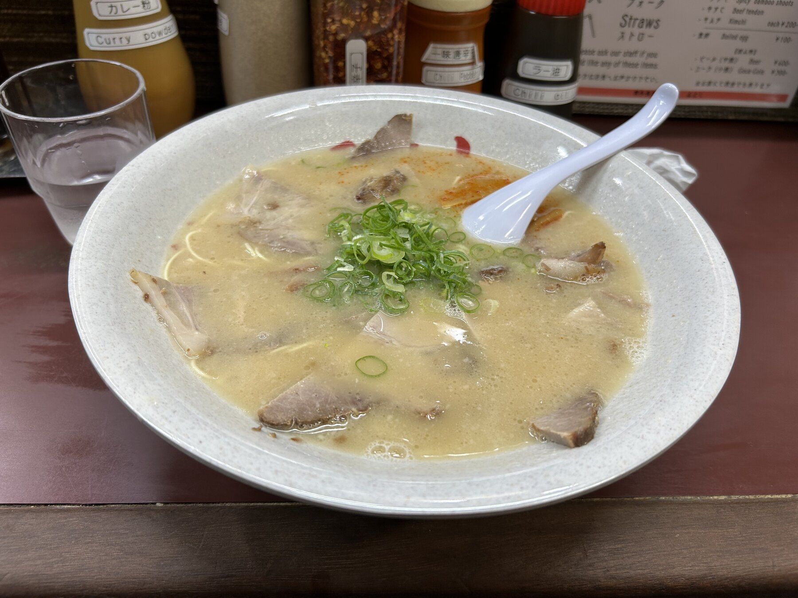
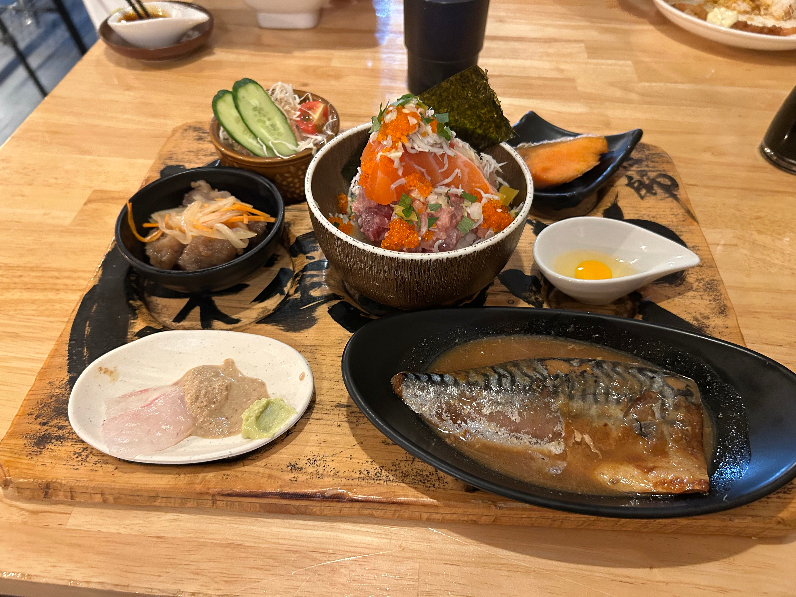

#+TITLE: 株式会社はてな インターンシップ 参加記
#+DESCRIPTION: サービスプラットフォームチームにいました
#+TAGS: インターン はてな
#+DATE: 2026-09-07
#+DRAFT: false

* はじめに
キュレェです。[[https://hatena.co.jp/recruit/intern/2026][はてなサマーインターンシップ 2026]] に参加しました。3 週間 (出社 1 週間・リモート 2 週間) でした。

#+CAPTION: はてなインターンに来ました

* 参加したきっかけ
高専 4 年の頃にもインターンに応募したものの、当時は舐めたガキだったので面接がよくわかっておらず、適当な受け答えをして落ちた記憶があり、大学 3 年になった今の自分が通用するか確かめようと思い、リベンジとして受けました。

面接では一番 Star のある [[https://github.com/Kyure-A/agent-skills-nix][agent-skills-nix]] の話を主にしました。

あとひたすら「はてなブログ好きです！」と言っていた気がします。最近は自分のブログに移行して全然使えていないのですが......。

数年前のインターンは 1 日で結果が出ていたらしいんですが、今年は 3 週間くらいかかっていてドキドキしました。

某メガベンチャーのインターンシップも合格していましたが、はてなのほうが枠が狭そうという不純な動機と、地元である関西に帰りたいという理由もあり、はてなを選びました。

* 出社日
** 1 日目
初日は 11:30 集合と少し遅めで嬉しかったです。スマホを落としたら壊れてしまったのでちょっと不安でした。
話しているとメンターの {@hatena:ymse} さんがルービックキューブを先着 1 名でくれるとのことで、いただきました。インターンウラモク (裏目標) としてルービックキューブを 6 面揃えられるようにすることにしました。

{@hatena:ventman} さんとは前回の Progate のインターンも同じだったので「おう！」みたいな感じで安心感がありました。

Web API と Web フロントエンドの講義を受けました。

なんと、自販機が無料で飲み放題ということで無限にカフェイン飲料を飲んでいたらどんどん不安になってきてしまい、自らのカフェインへの弱さを自覚して次の日から控えるようにしました。

初日は歓迎会があり、寿司が出てきて嬉しかったです。

{@hatena:Windymelt} さんがいました。2 ショットを撮りました。E-ink デバイス ([[https://santekdisplay.com/products/ez-sign-nfc-e-paper-display-4-color][EZ Sign]]) を名札に入れているのが良くて「欲しいなあ」と言っていたら、なんかもらえました。なぜ......？ これを入れたら名札入れを破壊してしまいました。ごめんなさい ><

#+CAPTION: いただいた E-ink デバイスを名札に入れた様子

あとは「はてなマル[fn:1]のステッカーも欲しいなあ」と言っていたらオフィスに残っていた最後のロットが出てきたので、インターン生全員がもらえることになりました。言ってみるのって大事ですね。

** 2 日目
ホテルにチェックインしたにもかかわらず一度実家に帰りました。理由としてはスマホがぶっ壊れたので、家に置いてあった壊れた iPhone を修理するためです。

RDBMS と コンテナ・k8s の講義を受けました。

会社のコーヒーマシンにはデカフェのものもあるのでひたすらそれを飲んだり、自販機で CHILL OUT を飲んだりと、1 日目と落差が激しい日でした。

Apple 京都で壊れた iPhone の代替機をもらいました。大事に使うぞ〜

2 日目からインターンの前半課題であるブログシステムの必須課題に進みますが、俺はこの行動のせいで数時間の遅れを取っていたうえに、正規表現で Markdown のパースをしようと頑張り始めました。他の参加者の皆さんはおとなしく Markdown Parser を使っていたのでさらに遅れを取ります（俺はてっきり自前実装するから必須課題なのではと思っていたので、みんな思い切りがいいなと思いました）。

あとこれはあんまり遅れとは関係ないですが、他の皆は Go を使っていたのに俺だけ TypeScript で Renderer を実装していました。

夜ご飯は豆腐？の店でした。最初は豆腐主体！？と思ったものの意外と満足感があってすごい。参加者全員食が細かったというのもありますが......。

帰ってからルービックキューブをやって 6 面完成しました。

結局深夜になるとお腹が空いてきました。

関西に帰ったら食べたいラーメン屋が三条にあったので、結構歩く距離にあるにもかかわらず行ってしまいました。深夜のラーメンが一番気持ちいいですからね。

#+CAPTION: ずんどう屋 味玉 HOT ラーメン

ドカ食い気絶となります。

** 3 日目
クラウド・運用とプロダクトマネジメントの講義を受けました。プロダクトマネジメントの講義を踏まえ、「必須課題に加えてどのような機能をブログシステムに実装するかを考えよう！」ということになり、俺はカスタム CSS を実装することにしました。

一応 15:00 くらいに必須課題が完成しましたが、その後すぐに既存の Markdown Parser ([[https://github.com/showdownjs/showdown][showdown]]) に置き換えるなど、悲しい感じになっていました。後にメンターの方々に「ランダムで自分の Parser と既存の Markdown Parser を入れ替えればいいのでは？」と言われて、そういう遊び心はあんまりなかったなあと反省しました。

JavaScript の正規表現における [[https://developer.mozilla.org/ja/docs/Web/JavaScript/Reference/Regular_expressions/Capturing_group][Capturing Group]] を全く知らなかったので勉強になりました。

焼肉に行きました。牛タンを食べまくっていました。

#+CAPTION: 食べまくった牛タン

オフィスに帰った後ガブガブ酒を飲んでかるた[fn:2]をやっていました。

** 4 日目
実装ラストスパートとなり、講義は「セキュリティ」の 1 つだけでした。

カスタム CSS の実装に入ります。Go の [[https://pkg.go.dev/html/template][html/template]] を使うだけなのでさほど時間はかからないだろうと思っていたのですが、Go のお作法がよくわかっていなかったこともあり、かなり時間がかかってしまいました。動作が軽ければ MCP Server でも実装できたら面白いなと思っていたのですが、叶わず。

大雨が降っていて帰れない時間があったので、しばらく酒を飲んで会社の人と高専の話をしていました。(高専 sage ではなく age の話です)

その後、趣味の VRChat をしながら酒をガブガブ飲み、寝落ち...... 

** 5 日目
自然な目覚めをしました。自然な......？
インターン出社最終日にして死を確信しました。アラームを鳴らせる機器が全てバッテリー切れでおしまいだ......と思っていたのですが、エアコンの時計を見たら 8:40 で耐えてました。よかった〜！

5 日目にして初めて朝食ビュッフェ券を使うことができました......。毎日 10 時とかに起きていたため。

ギリギリ間に合わず、社長である {@hatena:chris4403} さんの就任 4403 日[fn:3]はお祝いできなかったので申し訳なかったです。祝いたかった......。

AI エージェントとチーム開発の講義がありました。

二日酔いがひどすぎて飯が食えず、{@hatena:onishi} さんに食べていただきました。この人食い過ぎだし飲み過ぎで真似できねえ......

ついに後半で使う MacBook が貸与されたのでセットアップをしていました。社内の Cosense にアクセスできるようになって嬉しい。独自ドメインの Cosense とか初めて使ったな。まあそらそうかという感じですが......

はてなのサービスのステッカーも「欲しい！」と言っていたらいっぱいもらえました。うれし〜

かるたをやったり人と話したりしていると一瞬で時間が過ぎていきました。

「はてなマルを処分したいからインターン生は学んだことを書いていけ！」と言われたので書きまくりました。（俺は主に水色）

はてなマルかわいいのになあ。

#+CAPTION: はてなマルへの落書き

0:00 くらいにラーメンを食いにいきまして......

#+CAPTION: 出社最終日の深夜に食べたラーメン

結局 2:30 くらいまでオフィスにいました。楽しかった〜。

* リモート
サービスプラットフォーム (以下 SPF) に配属されました。メンターは {@hatena:laminne} さんでした。アサインされたタスクは、[[https://www.w3.org/TR/fedcm/][FedCM]][fn:4] (Federated Credential Management API) に関わる実装を行い、[[https://hatelabo.jp][はてラボ]]から利用するようにするというものでした。

** 1 週目
はてラボは Go で実装されているものの、俺は Go をほぼ書いたことがない（前述した通り）ので、同じ配属先のインターン生である {@hatena:fum1kun} さんにおんぶに抱っこでした。

仕様を見た感じは（雑にスピード重視でやれば AI エージェントなしでも）1 日で終わらせられるだろ！と思っていたわけですが、業務レベルのレビューだとそういうわけにもいかず、1 週間かかってしまいました。いかに普段俺が雑に開発をしているかを痛感しました。

俺も相方が出したコードをレビューするわけですが、出社日は LLM 禁止だったおかげでコードリーディング力が復活してきており、まだ読めました。でも Go が読めないのでデバフでトントンだったかもしれない。指摘したい点がロジックの本質的な欠陥なのか、Go の言語仕様の都合による問題なのかといった切り分けができず......。
({@hatena:onk} さん曰く「レビュー体験こそ一番持って帰ってほしいもの」らしい)

FedCM の実装のうち ID Assertion endpoint や、既存の OAuth の仕組みを拡張して FedCM に対応させるところ、Branding への対応などをやっていました。 

*** FedCM の流れ
FedCM を知らない人のために、ざっくりとした仕組みと流れを説明しておきます。

FedCM は、IdP (Identity Provider) と RP (Relying Party) の間で、ブラウザが仲介して安全に認証を行う仕組みです。

RP がブラウザの API 経由でログインを要求すると、ブラウザ自身が IdP のログイン状態を確認し、アカウント選択ダイアログを表示します。ユーザーがアカウントを選択すると、IdP から発行された認可コードやトークンを RP が受け取り、ログインを完了します。

Chrome などの Chromium 系ブラウザを使っていると、Web サイトで右上に「Google でログイン」のようなダイアログがポップアップするのを見たことがある人も多いと思いますが、あれを実現するための標準化されつつある Web API です。今回はこの FedCM に関わる実装を行い、はてラボから利用できるようにしました。

レビューと実装を進めると、単にログインできればよいという話ではなくなってきます。Origin と redirect URI が本当に対応しているか、PKCE の challenge が正しいか、というところを一つずつ確認していきました。

一度発行した認可コードが、ログアウト後や Session Cookie のローテーション後にも交換できることや、2 回目は交換できないことも重要です。コードのライフサイクルまで考える必要があり「認証まわり怖え〜」となりました。

Playwright のブラウザページから FedCM 用のリクエストヘッダを付けて、アカウント取得から assertion、token 交換まで E2E テストを通しました。失敗ケースまで試してみると、仕様を読んだだけでは見落としていた境界が見えてきてよかったです。

** 2 週目
初日は Apple 京都に行って iPhone の代替機を返却して交換機をゲットしないといけないため、せっかくだしオフィスに行こうと思い、出社しました。出社日 6 日目となります。昼飯の海鮮が豪華すぎる！

#+CAPTION: 昼飯に食べた豪華すぎる海鮮

2 日目に実装が終わり、Staging 環境にデプロイすることができました。

3 日目に本番にデプロイされ、はてラボ 開発者ブログでも紹介されました！

[@preview](https://labo.hatenastaff.com/entry/2026/09/02/111126)

4 日目は発表資料を作成していました。{@hatena:fum1kun} さんと全然話さずに双方思い思いに作っていたのですが、なぜかはてなマルが異様に盛り込まれた、見た目が「うるさい」スライドになりました。ほたて[fn:5]の説明にもはてなマルを盛り込み、~<marquee>~ を使ってうるささを強調していたのですが、他のチームも追従し始めて見た目のうるささのインフレが発生していて面白かったです。

5 日目はついに発表！発表では最近ハマっている声帯模写を披露しようと思い、自己紹介で女声で「美少女で〜す♡」と言いながら始めましたが、冷静に振り返ると普通にふざけすぎだなと思いました。

https://x.com/hatenatech/status/2095716063157825583

数時間ほどブログ執筆をしたりチームの人と雑談をしたりと過ごし、18:00 から結果発表だったのですが、同率 1 位で優勝でした。

やった〜〜〜！声とかスライドも発表を盛り上げる一助になっていたようでなによりでした。

結果発表後は送別会をしていただき、インターンの感想戦や裏話を聞いたりしてわいわいしていました。

** 全体的な感想
自分の実力が通用するか不安でしたが、Go のコードがほとんど読めないところから始めたにもかかわらず、Staging から本番へのデプロイまで見届けられたので「キュレェ、生きていけそう！」となりました。まあ Go はまだあんまり読めませんが......。

そもそもログイン基盤があるプラットフォームに関わる機会ってなかなか貴重ですし、世界的に見ても少なそうな機能の開発・実装に関われたことがとても嬉しいです。

** 局所的な感想
- オフィスに酒があるのが嬉しすぎる
- Cosense (旧 Scrapbox) が knowledge の管理に使われていて本当に嬉しい。階層型のツールってスケールしないですからね

* さいごに
手厚く支えてくださったメンターの {@hatena:laminne} さん、頼もしすぎる相方の {@hatena:fum1kun} さん、そして関わってくださったはてなの皆さん、最高に刺激的で楽しい夏を本当にありがとうございました！

[fn:1] はてなマル: はてなサマーインターンシップのマスコットキャラクター（「？」の形をした青いキャラクター）
[fn:2] かるた: Git のコマンドや解説が書かれた取り札・読み札で遊ぶカードゲーム「Git コマンドかるた」のこと
[fn:3] 就任 4403 日: 代表取締役社長・栗栖義臣氏のはてな ID「chris4403」にちなんだ日数のお祝い
[fn:4] FedCM (Federated Credential Management API): サードパーティ Cookie 規制に対応し、プライバシーを保護しながら Web 上で安全に ID 連携（シングルサインオン）を行うために標準化が進められているブラウザ API。対応サービスではブラウザネイティブのログインダイアログが表示される
[fn:5] ほたて: 「Hot な Task を手掛けた」の略。はてなの社内成果発表・表彰イベントのこと
