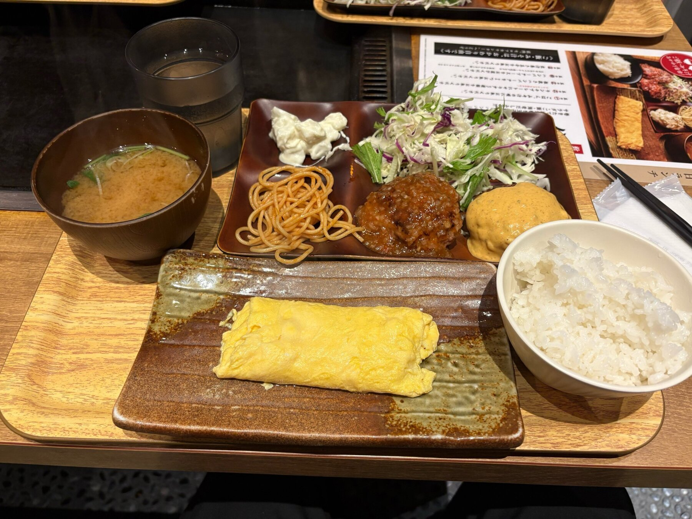
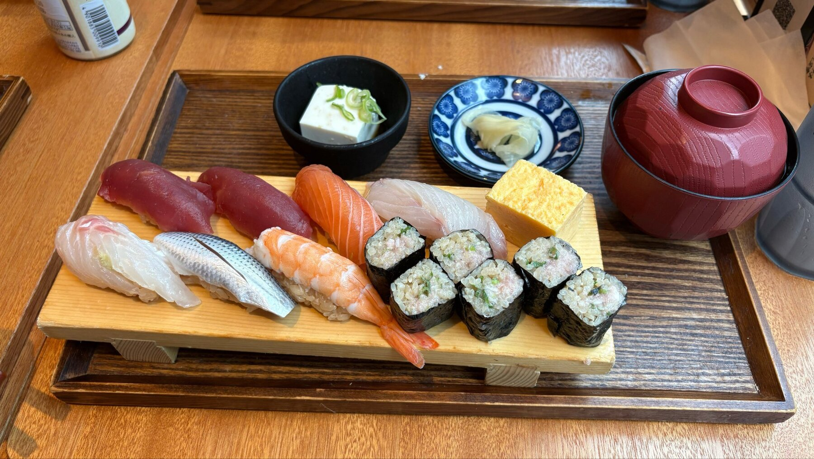
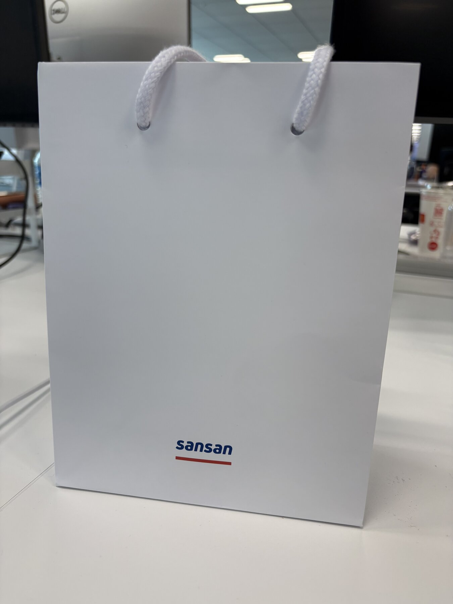

#+TITLE: Sansan 株式会社 インターンシップ 参加記
#+DESCRIPTION: Eight Event & Solution チームにいました
#+TAGS: インターン Sansan
#+DATE: 2026-07-31
#+DRAFT: false

* はじめに
キュレェです。[[https://newgradsevents.corp-sansan.com/engineer/200001][エンジニア職実務体験型有給インターン -Sansan Internship-]] に 2026 年 7 月に参加しました。
配属された Eight Event & Solution チームが管轄する [[https://meets.8card.net/][Meets]] (Ruby on Rails) の開発に携わりました。

* 参加したきっかけ
[[https://tkbpc.github.io/][Tsukuba Programming Circle]] でネモフィラを見に行った際にインターンの話になり、そのとき Sansan をおすすめされたので申し込みました。

書類選考・カジュアル面談・面接という構成ですが、面接はかなり柔らかな雰囲気で進行しました。

* 内容
** Week 1
*** 業務内容
まずは実力をメンターやチームメンバーの方々に把握してもらうために、簡単なタスクをコーディングエージェントを使わずに実装していました。
コードベースのキャッチアップを自力で行うのは久々で、触ったことのない技術だったことも相まってとても楽しい時間でした。Ruby on Rails は、以前使っていた JavaScript のフレームワークである NestJS と構造がかなり似通っているため、やりやすかったです。

勤務については、最初の 2 日は通勤したものの、つくばから渋谷までは 1 時間半ほどかかって負担が大きかったため、その後は週 1 出社・週 4 リモートのハイブリッド勤務になりました。

*** ランチ
出社日はチームの方々とランチに行き、ハンバーグや寿司、油淋鶏などを食べました。リモート日は自炊したり Uber Eats したり、昼休みを睡眠に充てたりしていました。

#+CAPTION: 初日のハンバーグ

#+CAPTION: 2 日目の寿司

** Week 2
*** 業務内容
コーディングエージェント (Cursor, Claude Code) が解禁されました。

最初のタスクとして与えられたのは、既存の CSV に新たな列を加えるというものでした。要件を見て簡単だろうと高を括っていましたし、実際その通り簡単でした。ただ、その時点の要件とイベントが近づくにつれて分かってきた要件は明確に異なっており、要件定義からやり直しになってしまいました。

新しい要件は、今まで 2 つあった CSV の出力モードに 3 つ目を追加するというものでした。さらに、CSV のヘッダーが 3 段になりました。元々の 2 つは 2 段でした。Excel 的に扱われる CSV を久々に見たので少しびっくりしました。

レビューまで終わっていた詳細設計とタスク分割は作り直しになり、実装計画は当初の約 6 倍に膨らみました。受け入れ条件が「何を作るか」に寄っていて、「なぜ作るか」「どんな価値につなげるか」が十分に言語化されていなかったことも、手戻りにつながっていたように思います。AI を使えば作り直す速度は上げられますが、上流の認識がずれていると普通に全部作り直しになります。

要件定義のやり直しには PdM (プロダクトマネージャー) さんやフロントエンド担当との調整が必要でしたが、論点を自分で整理して働きかけるところまで進められず、メンターに支援していただきました。自分が想定していた開発の進み方との違いに戸惑い、少しモチベーションが低下していました。それも相まってかはっきりと体調を崩し、2 度ほど早退させていただきました。この作業は Week 3 に続きます。

*** ランチ
オンラインランチが何度かあり、普段は業務で関わらない方とも話せてよかったです。一方で体調を崩してからは、ポテトチップスだけで済ませる日もありました。

** Week 3
*** 業務内容
要件定義を巻いていただいたのと、体調が復活したおかげでモチベーションもぐんぐん上昇しました。

Week 2 から続いていたリード CSV 出力機能は、既存の出力に影響を与えないように実装しました。この機能に関する PR は 5 本になりました。機能要件を書いて PdM さんに確認を取るところまではできたものの、要件そのものを決める議論には入れませんでした。エンジニア側からも KPI やユーザー価値を確認し、実装コストを選択肢として提示する必要があると学びました。

次に、チームで使われていた AI コードレビュー基盤の改善に取りかかりました。従来は、872 行あるレビュー観点のガイドラインを 1 つのエージェントが毎回まとめて読んでいました。人間のレビュー指摘が日々追加されていくため、観点が増えるほど 1 つあたりの注意が薄くなります。また、Claude が実装したコードを Claude がレビューする機会が増え、同じ盲点を持ちやすいという問題もありました。

そこで、レビューを設計・堅牢性・セキュリティ・パフォーマンス・フロントエンド・テスト・ドメイン固有・URL 設計の 8 観点に分割しました。変更されたファイルから必要な観点を機械的に選び、各エージェントが独立してレビューした結果をオーケストレーターが統合します。さらに、指摘が妥当かを確認する検証層も追加しました。1 エージェントあたりの読み込み量は、平均で約 8 割減りました。

*** ランチ
リモート日は Uber Eats や適当な自炊をしたうえでオンラインランチをしていました。

*** インターンヨリアイ
Sansan には、飲食を通じて社内の交流を促す [[https://jp.corp-sansan.com/mimi/2023/02/yoriai.html][ヨリアイ]] という制度があります。インターン向けのヨリアイにも参加し、人事の方と酒を飲みながら、業務中より率直な話ができて楽しかったです。

** Week 4
*** 業務内容
Week 3 に作った AI コードレビュー基盤を、過去にマージされた 5 本の PR で検証しました。新しい方式では、人間のレビュアーと Devin の両方が見逃していた、本番コード上の並び順のバグを検出できました。コードを確認できた範囲では事実誤認もなく、メンターから「これまでのレビューでなかった結果が出ている」と評価していただき、本番に導入できました。

指摘数は増えたものの、数を KPI にしてしまうとよくないです（閾値を下げればいくらでも増やせるので）から指摘数は KPI にせず、指摘が正しいか人間の指摘を先回りできたかを見る設計にしました。件数やコスト、処理時間は上限だけを監視します。

その後は成果発表会の資料を作成していました。

*** ランチ
最終出社日はお寿司をご馳走になりました。

#+CAPTION: 最終日にいただいたさくらそば

*** 成果発表会
インターンの最終出社日には、1 か月間の成果発表会がありました。発表前はかなり緊張していたものの、本番は意外と普通に話せました。

一方で、配属先との相性について聞かれた際には、正直に少しミスマッチだったと答えました。理由は、開発対象が BtoB のプロダクトで、自分自身はユーザーとして直接触れる機会がなく、開発のやりがいを感じにくいとわかったからです。プロダクトの良し悪しではなく、自分が日常的に使えるプロダクトを作りたいという志向の問題でした。実際に働いたことでそこに気づけたのも、インターンの大きな収穫でした。

*** フィードバック
メンターの方々からは、詳細設計・実装に入ってからの速度と、AI の活用を評価していただきました。複数の PR を並行して進めていたことや、実装に入ると一気に進行速度が上がったことが印象に残っていたそうです。「実装が特に早い」「AI の使いこなし方において優れている」と言っていただけて嬉しかったです。

AI コードレビュー基盤の改善は、最初から用意されていた課題ではなく、自分から提案して取り組んだものでした。チームでも必要性を感じつつ手が回っていなかったところに手を挙げ、実際に使えるところまで仕上げた点を評価していただきました。言われたことをこなすだけでなく、もっと良くできないかを自分で考えて動けることが自分の強みなのだとわかりました。

マルチエージェント化によるコストの増加や検知率を検証したことに加え、定期的な評価とレビュー観点の更新まで仕組みにした点にも触れていただきました。作ったものをどう検証し、使い続けていくかまで考えたことが伝わっていてよかったです。

一方で、どんな環境や状況だと自分が力を発揮しやすいのかを知れたことは、今後の就職活動でも役立つという話がありました。自分に合う環境を知るとともに、物事の捉え方を変え、自分から力を発揮しやすい状況を作っていくことも期待されました。Week 2 と Week 3 での自分の動き方を振り返ると、今後考えていきたいところです。

* 感想
要件をざっくり決めてすぐ実装する進め方しか知らなかったので、イベント開催日が固定され、顧客のリードを預かるプロダクトの開発には最初かなり戸惑いました。しかし、QA・PdM 確認・リリース調整に時間をかけるのは、事業上の理由があるからだと理解できました。会社の規模だけでなく、事業の性質によって開発の進め方も変わるということです。

Ruby on Rails はほぼ未経験でしたが、大きなコードベースを読み解き、1 か月で機能開発からレビュー基盤の改修まで進められました。振り返ると、このキャッチアップの過程が一番楽しかったです。

Notion を操作する Agent Skills、レビューエージェント、Devin による自動実装など、AI が実際の業務に組み込まれている現場を中から見られたことも面白かったです。最初は用意された AI エージェントを使う側でしたが、最後にはその基盤を改善する側に回れました。

1 か月間お世話になったメンター、チームの皆さま、人事の皆さま、ありがとうございました。
