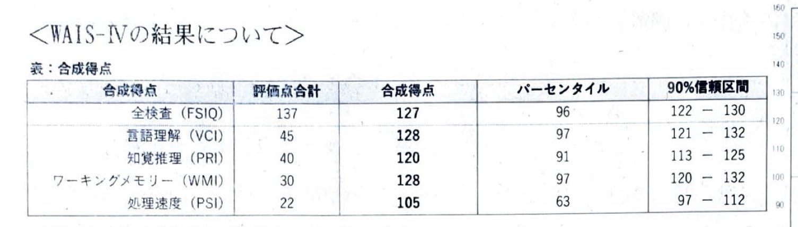

#+TITLE: 心理アセスメントの結果が出た
#+DATE: 2026-05-12
#+DESCRIPTION: WAIS-IV, AQ, CAARS を受けました
#+TAGS: WAIS AQ CAARS IQ
#+DRAFT: false

** はじめに
小学生の頃は通知表に「人の話を聞かない」「落ち着きがない」と書かれていた子供であった。
Twitter を見ていると発達障害のフォロワーが[[https://ja.wikipedia.org/wiki/%E3%82%A6%E3%82%A7%E3%82%AF%E3%82%B9%E3%83%A9%E3%83%BC%E6%88%90%E4%BA%BA%E7%9F%A5%E8%83%BD%E6%A4%9C%E6%9F%BB][ウェクスラー成人知能検査]] (WAIS) なるテストを受けているのを多く観測していたので漠然と受験したいと思っていたものの、高専時代に受けることは叶わなかった。高専の支援室に質問したにもかかわらず、受験できるか否かの答えが帰ってこなかったというのが主な原因であるが。

筑波大学には「[[https://dac.tsukuba.ac.jp/][ヒューマンエンパワーメント推進局]]」という組織があり、ここが無料で WAIS-IV などのテストを実施してくれている。入学してすぐに面談を受け、受験を行い、結果が出たのが 05-07 だ。この結果について本記事では評価していこうと思う。

受けたもの (と大雑把な説明) は以下である:

- AQ: ASD 診断テスト
- CAARS: ADHD 診断テスト
- WAIS-IV: IQ 診断テスト

** AQ

50 点満点中 33 点以上をカットオフとして ASD 傾向があると評価される。

以下のような結果だった:
- 総合得点: 16 点
- 社会的スキル: 4 点
- 注意の切り替え: 5 点
- 細部への関心: 2 点
- コミュニケーション: 4 点
- 想像力: 1 点

総合得点・観点ごとにおいてもカットオフ値を下回っているので、ASD 傾向は低いと評価された。

まあ電車とかに興味ないしな。あんなんただの乗り物や。

** CAARS
90 点満点中 65 点以上をカットオフとして ADHD 傾向があると評価される。

以下のような結果だった:
- 総合得点: 79 点
- 不注意/記憶の問題: 82 点
- 多動性/落ち着きのなさ: 66 点
- 衝動性/情緒不安定: 74 点
- 自己概念の問題: 39 点
- 不注意型症状: 72 点
- 多動性 - 衝動性型症状: 75 点

自己概念の問題以外はカットオフを超えていた。ポジティブなキチガイらしい。
自分自身がこういう人間であると理解して 20 年間過ごしてきたので、自分ができないことに直面しても自己否定とかしないんだよな。別に俺ができないだけだし人がやればええねん。
逆に困りごとを軽く見積もってしまうせいで、色々なタスクが pending してしまっています。助けてください。

** WAIS-IV

一応文字起こしをしておくと、以下のような結果だった:

- 全検査 IQ (FSIQ): 127
- 言語理解 (VCI): 128
- 知覚推理 (PRI): 120
- ワーキングメモリー (WMI): 128
- 処理速度 (PSI): 105

もう少し高低がはっきり出ると思っていたので、処理速度が 100 超えている時点で面白くない。

ディスクレパンシー (指標間の数値の差) が 23 なのだが、友人のディスクレパンシーは 40 とかなのでそれに比べたら凡庸な結果で面白くない。

あとは MENSA に入れるほど IQ が高いわけではないというのも面白くない。いやまあ IQ に面白さを求めるというのも変なのだが。

次項では各項目について分析していきたい。テストの小項目についての点数は開示されていないのでわかりません。チラッと見せてくれたけど検査結果の書類には載せてくれていなかった......

*** 言語理解
Twitter オタクくんなので低いわけがないだろうと自負していたが、まあ低くはなかった。

類似は全部簡潔に出来ていたらしい。

単語については 1 単語マジで知らないのが出てきたのでわかりませんつった。

知識については正直地理や歴史が疎すぎてなんともという感じ。

*** 知覚推理
インターネットの IQ テストでよく問われるのはここだと思うが、そこまで出来が良かった自信はない割にはできた。

積木模様はかなり早かったらしい。最初は結構手間取ったが、3 回くらいやってからこれってグリッドごとに区切ればいいなと気づいたので自認でも早かったと思う。

行列推理ではかなり詰まった。2 問間違いとからしい。あとはスピードが早くなかったのだと思う。

パズルについては覚えてないです。

*** ワーキングメモリー
ワーキングメモリーの体感とは全然違う値が出て驚いたな。俺ってさっきしようとしたことをすぐに忘れる鳥頭であることを自認しているのだが。タスクとしての質が違うのだろう。

数唱・語音整列はかなりできていたつもり (6 - 7 桁くらい) だったが、友人が 140 くらいあったのには遠く及ばず悔しいわね。算数について 1 問だけマジでわからない計算（比の計算が何度やっても変になる）があって諦めたのが悪そう。

*** 処理速度
正直他に比べて高い気はしなかった。実際メンターの方からも明らかに低いという話をその場で伺っていた。だからといってとても低いというほどではなくてがっかり（面白くないので）

それはそうとして他の IQ 群に比べて低いのは間違いない。

記号探しは割と出来たうえにペースが保てていたらしいが、符号については視線移動が多いせいか平均より遅かったらしい。ここが如実に低い原因であると思う。

上下の視線移動が発生するタスクは主に板書らしいが、人生でほとんど板書を取る機会がなかったので困っているのかわかりません。逆に困っているせいで板書を取らない人生になってしまったのだろうか？

** 総合評価
ヒアリングや上記の結果から、ADHD の特性を有する可能性が高いという結果であった。視覚情報を素早く作業していくことが苦手らしい。

大学のアセスメントのみでは確定診断が降りるわけではないので、診断が欲しければ病院を受診してねという形になる。

正直、診断が欲しいかと言われると 5:5 くらいだな。手帳とか別にいらないし。服薬とかしなくてもそこまで困ってないしな。

友人は凹凸多めの発達特性であるため WAIS-IV を見るだけで割と自己理解が深まっているらしいが、俺は処理速度以外平坦なせいで考察が難しい。LLM に考察を丸投げしたところ、俺は言語化できるものの実作業にタスクを落とし込むのが難しいらしい。

逆に明確に困り事が見えにくいことが面白いよね。らしい　しばくぞ

** 今後
筑波大学には保健管理センターがあるが、アセスメントを受けた後にここを通すことで修学における[[https://dac.tsukuba.ac.jp/shien/disabilities/developmental_disabilities/reasonable_accommodation/][合理的配慮]]を受けることができるらしい。1, 2 限にある演習をオンデマンドで受けられるようになればかなり楽になるなあと思う。
カスみたいな内容だしな。
