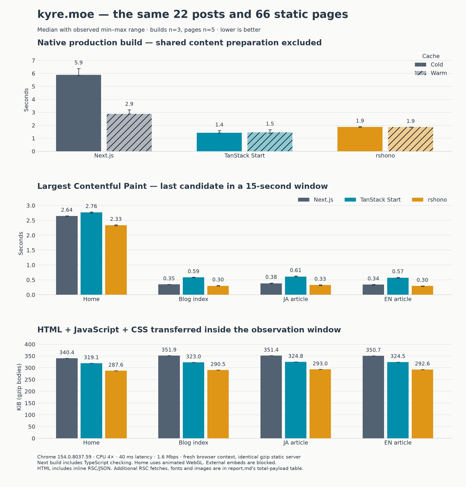

# kyre.moe：Next・TanStack Start・rshono 実測比較

このサイトではビルド時間はTanStack Start、初回表示と転送量はrshonoが有利でした。Startへ移る判断は妥当ですが、ブラウザ表示がNextより速くなるという結果ではありません。rshonoは初期ロードを重視する選択肢で、GitHub Pages向けのRSC配信アダプターを今回追加しています。

## 測定結果

同じ22記事・66公開ページ・OGP・画像を使っています。全18回のビルド、60回のページ表示、15回のクリックが成功しました。以下は中央値です。

| 指標 | Next.js | TanStack Start | rshono |
| --- | ---: | ---: | ---: |
| ビルド：フレームワークキャッシュ削除 | 5.89秒 | 1.42秒 | 1.87秒 |
| ビルド：キャッシュ保持 | 2.89秒 | 1.45秒 | 1.87秒 |
| Home LCP | 2.64秒 | 2.76秒 | 2.33秒 |
| 日本語記事 LCP | 380 ms | 612 ms | 332 ms |
| 日本語記事 初期JS（gzip） | 320.6 KiB | 295.5 KiB | 262.8 KiB |
| 日本語記事 全転送ボディ | 374.2 KiB | 339.4 KiB | 307.6 KiB |
| 一覧→記事 DOM ready＋2フレーム | 301 ms | 272 ms | 234 ms |
| クリックの最小〜最大 | 287〜413 ms | 257〜307 ms | 205〜694 ms |
| Home CLS | 0.024 | 0.030 | 0.052 |

LCPは主要コンテンツの描画時刻、CLSはレイアウトずれの指標です。ブログでは全3版ともCLSがゼロでした。HomeではrshonoのCLSがやや大きく、記事の長い処理によるブロック時間もrshonoが常に最小という結果ではありません。

クリックは全15回ともページ再読み込みのない遷移でした。先読みは各実装の設定のまま有効です。中央値ではrshonoが速いものの、205〜694 msとばらつくため、わずかな中央値差で遷移性能全体を断定するには足りません。この値は本文がDOMに存在するまでの時間で、視覚的なトランジション完了やINPではありません。

## 条件と解釈

測定日時：2026-10-01T11:52:01.295Z。Apple M4、10コア、32 GiB、Node v26.5.0、Chrome 154.0.8037.59。

ビルドは各条件3回、ページ・クリックは各5回。ブラウザはCPU 4倍スロットル、下り1.6 Mbps、遅延40 ms、1440×900。新しいブラウザコンテキスト、同じgzip静的サーバー、外部埋め込み通信なしで15秒観測しました。公開環境の実ユーザー統計ではありません。

ビルド計測には各フレームワークのproduction buildと必要な静的出力整形を含め、共通の記事・OGP生成は別に測っています。Nextは標準の型検査込み、Vite/Rspackは型検査なしです。型検査は別途全3版で通しています。純粋なコンパイラ速度の比較とは区別してください。coldでも依存パッケージとOSファイルキャッシュは保持しています。Start/rshonoではproductionの永続コンパイラキャッシュが作られず、warmの短縮はほぼありません。

共通準備はキャッシュなし22.84秒、あり10.90秒（各1回）でした。サイト全体の待ち時間にはこの処理も加わります。フレームワーク変更だけで全体が4倍速くなるとはいえません。

初期JSだけでなくHTML内のRSC/JSON、CSS、フォント、追加のRSC取得も全転送ボディへ含めています。これはメイン文書とメインフレームで観測した同一オリジンの完了済みHTTPボディで、ヘッダーを除きます。今回subframeはありません。グラフの3段目はHTML＋JS＋CSSだけなので、全転送量は表を参照してください。Homeは画像が約2.25 MiBを占め、フレームワークの差より大きい負荷です。

フォントは全3版で別ファイル配信に統一しました。rshono既定設定の未使用フォント埋め込み約105 KiBを除き、Viteの小さいフォントもインライン化しない設定です。変更前の診断データは別フォルダーに保存し、最終集計へ混ぜていません。設定を整えた実アプリ同士の比較です。

## 実装と再現

Next 16.3.6、TanStack Start 1.168.60、rshono 1.0.0-rc.23です。アプリ依存のReact/React DOMは19.3.0に揃えていますが、Next App Routerは内蔵19.3.0-canaryを使います。rshono upstreamの開発・テスト用依存は19.2.8で、今回の19.3.0との組合せはこのサイトのビルドとブラウザで検証したものです。各フレームワーク固有ランタイムの違いは保持しています。

rshono版はHTML＋Flightを静的に出力し、GitHub Pagesで動くようRSCリクエストをindex.rscへ向けるアダプターを追加しました。サーバーSSRの処理性能は今回の対象にしていません。

測定時は22記事・66ページを持つ作業コピーを使用しました。記事の未コミット変更はmasterへ含めていません。比較した実装は各worktreeに保存し、採用版はこのcheckoutのrshonoです。

[測定・再現コマンド](README.md)。全指標・生JSON・ソース差分・SHA manifestはローカルの `benchmark/results/` に保存しています。

検証：全66ページの静的HTML・metadata・OGP・404・sitemap、日英記事本文、型検査、lint。rshonoはFirefoxで言語切替・タグ・404・ソフト遷移、開発サーバーのHTML/Flight応答、Storybook production buildも確認しました。
