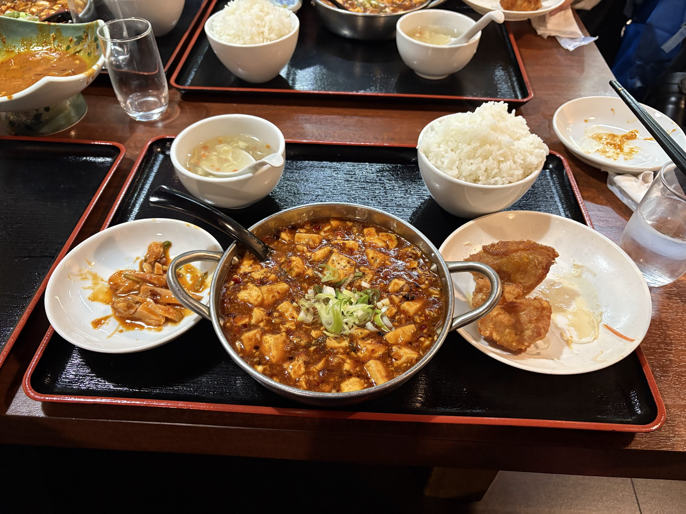
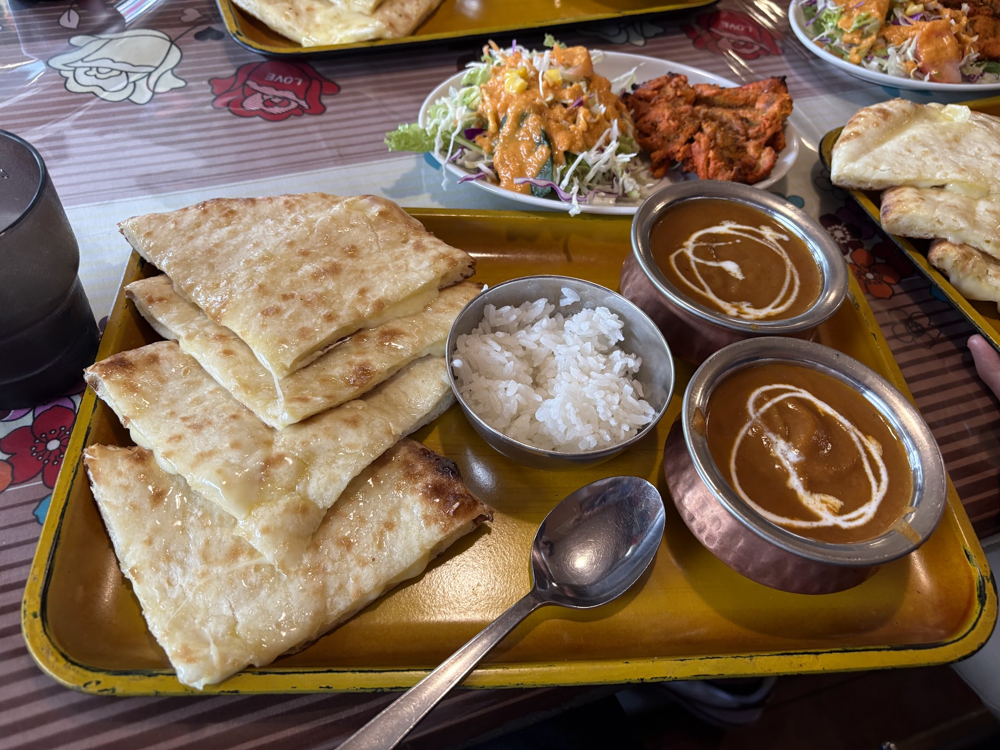
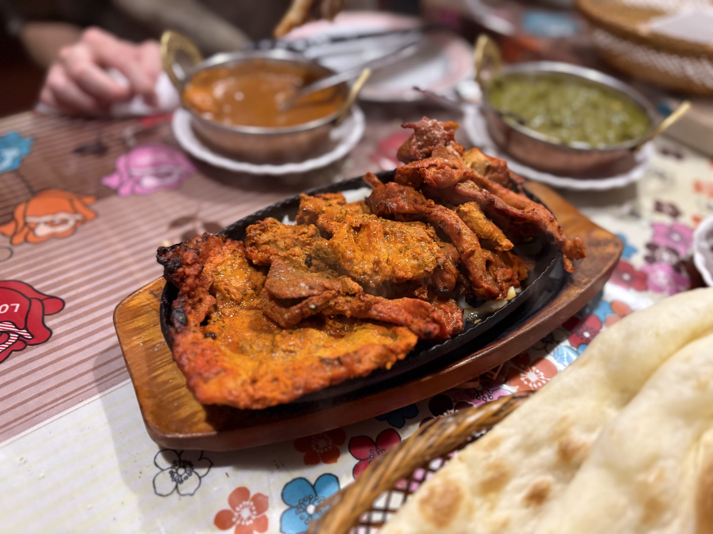
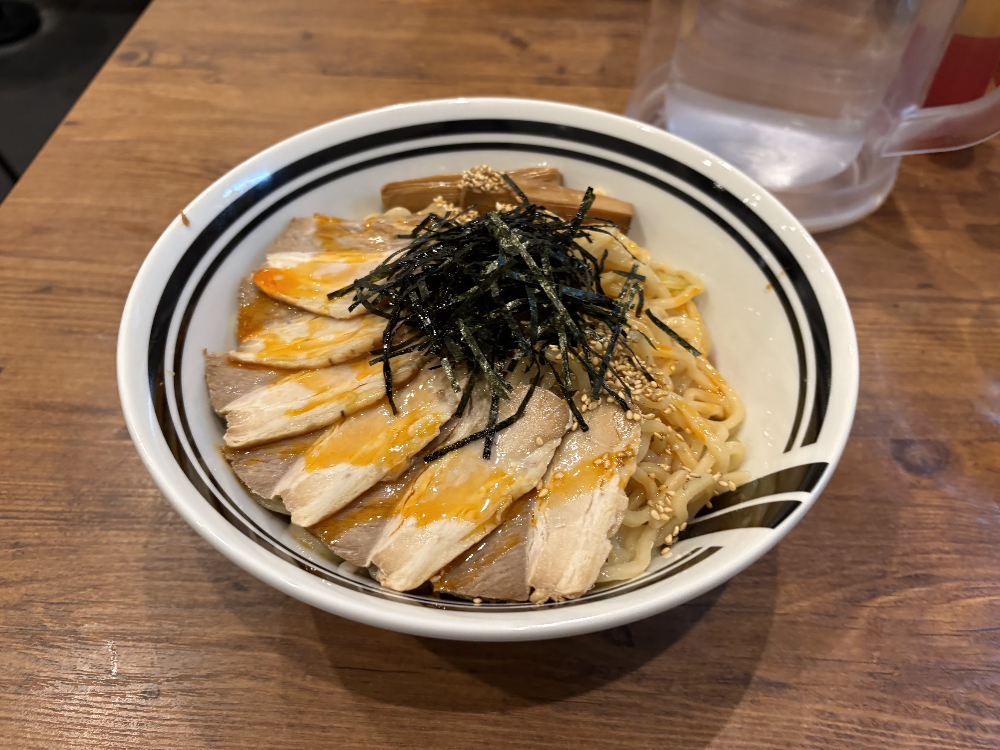
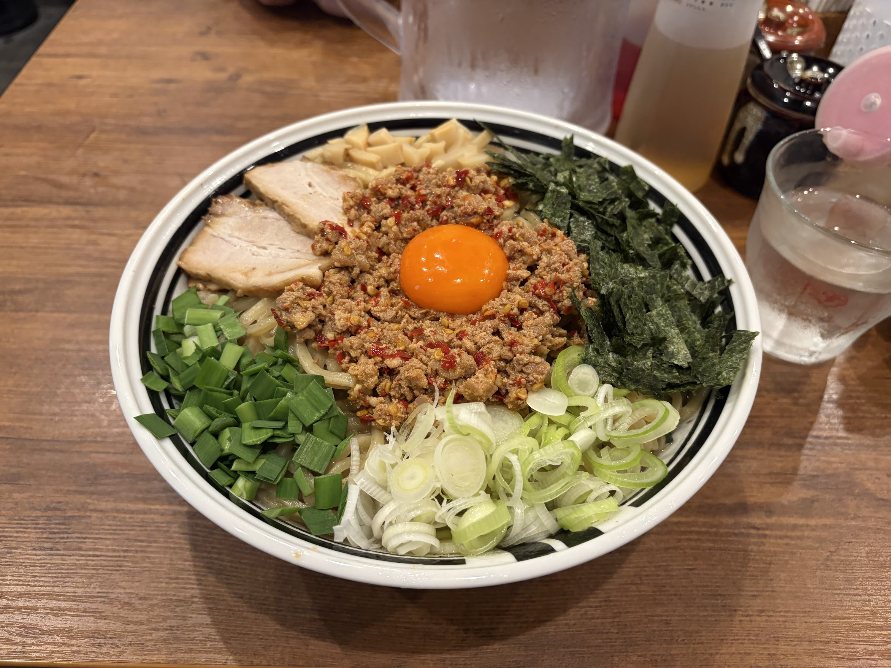
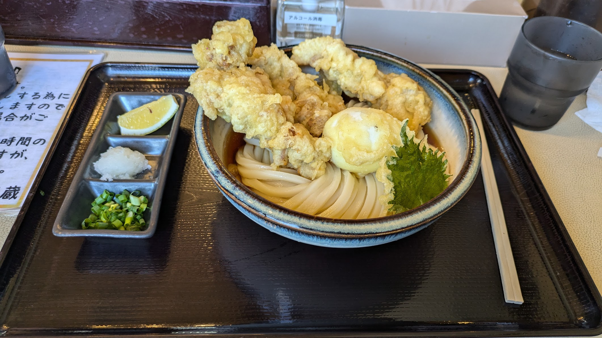
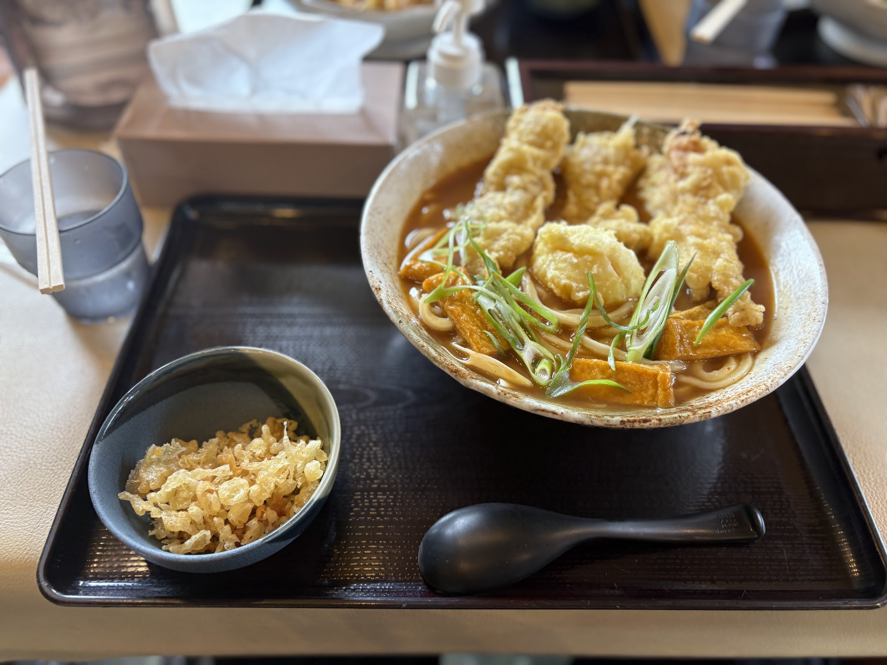
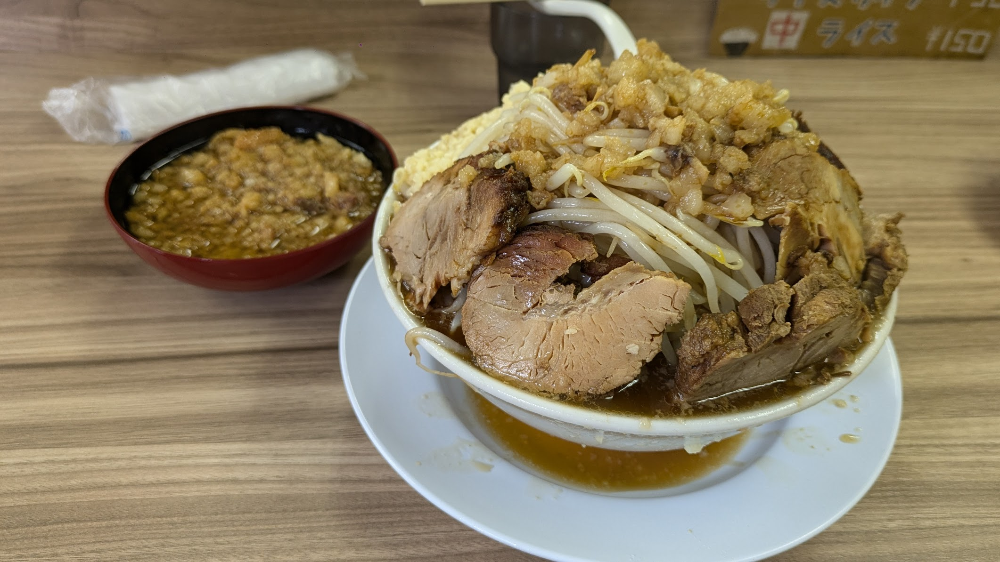
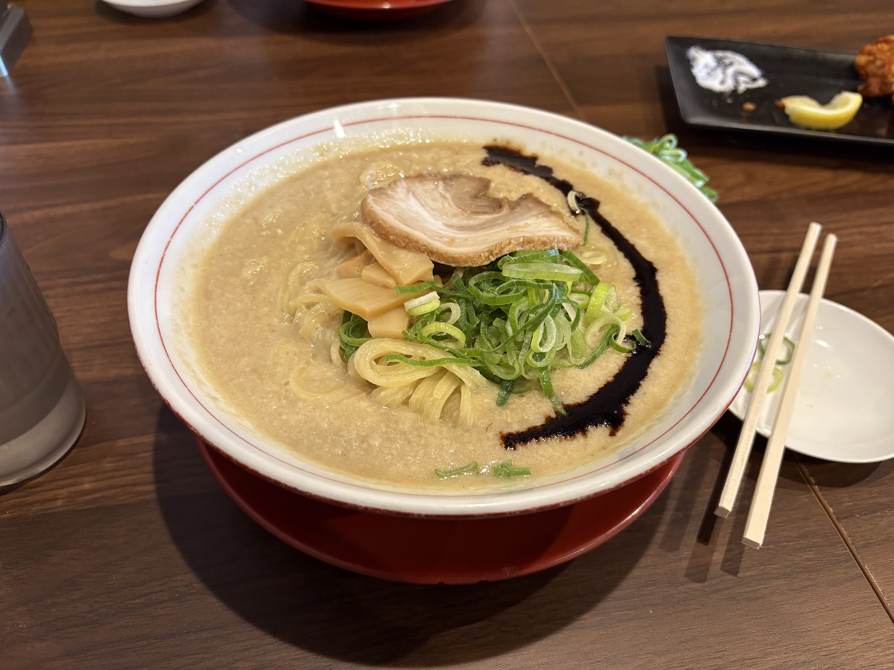
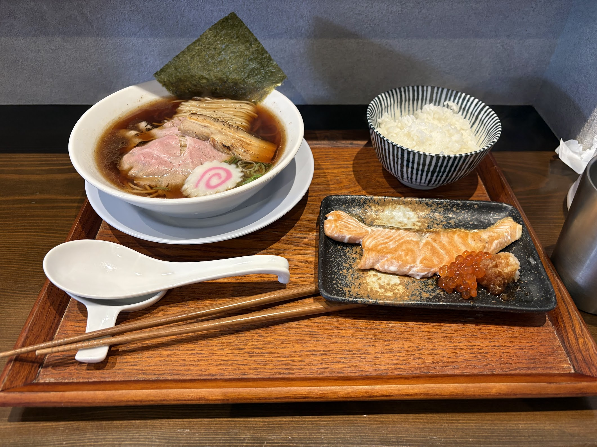

#+TITLE: 大阪公立大学高専付近で飯にありつくためには
#+DESCRIPTION: 近辺の飲食店について評価しておこうと思う
#+TAGS: グルメ 高専
#+DATE: 2026-02-17
#+DRAFT: true

** はじめに
キュレェです。5 年間過ごした高専から旅立つときがぼちぼちやってくる。ここらで高専生活においてよく通った近辺の飲食店について評価しておこうと思う。

弊学はまもなく大阪公立大学中百舌鳥キャンパスの跡地に移動するゆえに寝屋川市の飲食店情報は役に立たないため、この記事は自己満足かつ俺と同世代である弊学 (元) 学生への懐古を誘うためだけに執筆されています。

** コンビニ
近さとしては、ローソン > セブンイレブン > ローソン (1) = デイリーヤマザキ なので、だいたい授業が押したときは総意でローソンに行きがち。おれは正直セブンイレブンに行きたいんだけど。

*** セブンイレブン
寝屋川駅から弊学に向かう際には信号を 2 つ (3 つの場合もあるが、3 つになる出口から弊学の学生は基本的に降りない) 経由するのだが、2 つ目を渡った先にある。

店長と店員の男性が妙にふくよかであり、デブ向けの飯がよく仕入れられているのでかなりいい。俺はパートのおばちゃんに顔を覚えられていたので、髪を黒染めしたときには「あら〜」って言われた記憶がある。地味に嫌かも。

*** デイリーヤマザキ
後述する歴史を刻め、うどんらんぷ 若蔵の近くにある。

*** ローソン
寝屋川駅と逆方面の道路沿いにある。パチンコ屋が隣接しているので治安がそんなによくない。後述するらーめん一作の近くにある。

*** ローソン (1)
寝屋川駅から弊学に向かう際に駅の出口からすぐに所在しているのだが、あまり利用されない。俺は飯を買うというよりも提出物の印刷をするときに用いた。

*** ローソン (2)
ローソンの奥の奥にある。1 回しか行ったことがない。なんか弁当が充実しているからいいんだけど、遠いから行くわけなさすぎる。一応立項した程度である。

** よく行った飲食店
割とラーメン屋が多いかも。

*** 学内の食堂
俺が 1 年 - 3 年くらいまでは常翔学園と関係がある常翔ウェルフェアが運営をしていたのだが、ここが高いから不評で撤退したのにより高い業者が入ってしまったせいで高学年はめっきり行かなくなってしまっている。
行っているやつは低学年か情弱であるという認識で生きています。

*** 本格四川料理 華洋
寝屋川駅から徒歩 5 分圏内に 1 号店と 2 号店があり、それ以外に店がない謎の中華料理屋。

四川料理というだけあって辛くて痺れるようなメニューが多い店である。このチェーン店（？）は 1 号店より 2 号店のほうがメニュー全般が辛いのが特徴的だ。1 号店は商店街にあるのだが、2 号店はより駅側にある。2 号店は横断歩道を渡るからアクセス面では等価だが、2 号店のほうが店が明るくて綺麗なのでおすすめだ。辛いし。

俺は蒙古タンメン中本の北極ラーメンが好きなのだが、2 号店の "中辛" は北極より辛い。1 号店はふつうの中本未満なのだが。

ここまで辛さについて述べてきたが、辛くない料理のビルドクオリティももちろん高い。辛いものが苦手な友人もうまいうまいつって食ってるのでいいお店です。

*** インド料理 ミラン
セブンイレブンの近くにあるインドカレー屋。隠しメニューが堂々と壁に貼ってあるのが面白い。ずっとインドなのかネパールなのかわからない音楽が店内で流れていてテンションが上がる。

ランチが学生メニューだとめちゃくちゃ安い。インドカレー屋の平均的な料金は 1500 円 - 2000 円くらいであると思うのだが、1000 円以内で十分満足できる。ナンが 1 回おかわり無料なのが大きいだろう。

ディナーは 1 回しか行ったことないが、食べ飲み放題がある。俺は食べ放題しかやらなかったが、タンドリーチキンが食べ放題ゆえ無限に食べられるので嬉しい。3 回くらい頼んだ。

毎回 50 円か 100 円か引きのクーポンがもらえるのだが、1 人使ったら来たグループ全員に適用される上に、回収されないのでクーポン無限増殖バグが発生する。

友人は行きすぎて顔を覚えられているらしい。いい話。

*** 油そば・まぜそば ロマン
大阪電気通信大学生がよく帰りに通る商店街に所在している。通い始めた頃はあまり店舗がなかったのだが、だんだんグロースしていてすばらしい。

この店は学割があって 100 円くらい全メニューが安くなる上に、期間限定で配られているキラキラとしたシールを提示するとトッピングが無料になるので嬉しい。

この店のよくない点は、大阪公立大学高専について全く考慮せず大阪電気通信大学の休業期間で休んでいる点だ。大阪公立大学高専は一般的な国立高専や大阪電気通信大学よりも休業期間が短いので、厳しい。

*** うどんらんぷ 若蔵
とり天うどんが看板メニューのうどん屋で、3 本が最大なのだが 1 本増やすのに +100+ 150 円しかかからない。正直 3 本食うとデカすぎるので胃もたれするのだが美味しいし安いからついつい 3 本頼んでしまう。
天かすも頼んでおくとかなり盛れるので嬉しい店だ。授業が早く終わって昼休みにいくぐらいだと割とお客さんが多くて授業に遅刻してしまうのが玉に瑕だ。

*** ラーメン荘 歴史を刻め
関西圏では言わずと知れた二郎インスパイアのラーメン屋である。

俺が 1 年 - 3 年くらいまでは営業時間が授業終わりに行っても間に合うくらい (14:30 くらいに終わるときにいけるから 16:00 に一度終わるんだったかな) だったのだが、その後からは 11:00 - 14:00, 17:00 - 22:00 になったので終業後に行きづらくなってしまったせいで最近はあまり行けていない。

コールの際に「アブラ ダイスキ」と述べると別皿で大量のアブラが盛られてくる（日本橋店についてはコールが自由なので似たようなことができるのだが、歴史を刻めに共通している文化なのかはわからない）のがよい。3 年で仲良くなった 2 留している変な友人 (つまり 3 年次に 20 歳のやつ) に教えてもらって以降ここではそのコールをしている。

この店のよくない点として、妙に床がヌメヌメしているのと、奥側の席はマジで (docomo は特に) 電波が入ってこない点。

*** らーめん一作
ローソンの近くにあるラーメン屋で、系統としては天下一品が近い。一応チェーンなのはわかるが、4 店舗しかないらしいからまあいいだろう。
一度研究室の先生のおごりでもっともこってりのメニューを頼んでみたのだがふつうに厳しかった。ほどほどなこってり量がおいしいです。

*** おダシと銀しゃり 中華そば 虹空
丁寧なラーメン屋だ。卓上調味料がめっちゃ充実している。

*** 餃子の王将
華洋の 1 号店とほぼ隣接している。これはダジャレなのか？と思うのだが、華洋は火曜日が定休日（1, 2 号店ともに）なので火曜日に中華が食いたいときによく行っていた。

*** ガスト
ローソンの近くってほど近くではないが、所在している。高専祭の終わりや授業をサボってゆったり過ごすのに適している。あまり行ったことはないが滞在時間が長いゆえ思い出は割とある場所だ。

*** かつや
ガストよりもうちょい奥にある。2 回くらい行ったことがある。

*** マクドナルド
1 - 2 年 (?) は駅の中にあったのが駅の外になったので、バスとか自転車で通学している友人とも行きやすくなったのがいいね。特にそれ以外は言うことないです。マクドだから。

** 行ったことがないが友人から評価が高い飲食店
*** 魔法のパスタ
ラーメン一作の近くにあるパスタやさん。一応チェーンらしいのだが、寝屋川店以外の店舗が滋賀県にしかない上に 4 店舗しかないらしい。
